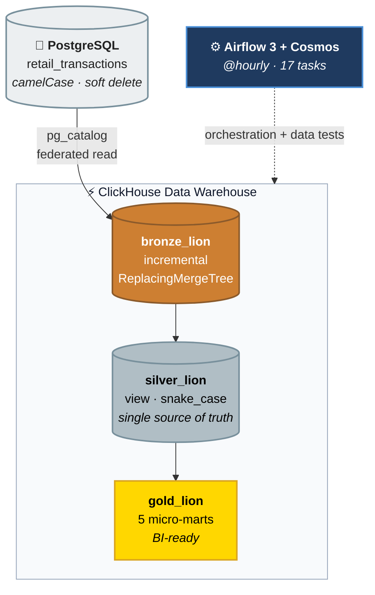

# 📦 Lion Parcel ELT — Data Warehouse

[](https://airflow.apache.org/)
[](https://docs.getdbt.com/)
[](https://clickhouse.com/)
[](https://www.postgresql.org/)
[](https://astronomer.github.io/astronomer-cosmos/)
[](#-testing)

An **ELT** pipeline that moves retail transactions from PostgreSQL into ClickHouse every hour, synchronises soft deletes correctly, and serves the result as five ready-to-query data marts. Airflow 3 orchestrates, dbt transforms, and Astronomer Cosmos renders every dbt model as its own Airflow task.

The defining trait of this project is that **there is no ingestion tool at all**. ClickHouse reads PostgreSQL directly through its built-in database engine — no Airbyte, no Debezium, no Kafka.

```bash
cp env.example .env && docker compose up -d --build
# Airflow UI → http://localhost:8080  (admin / admin)
```

---

## 📑 Table of Contents

- [🎯 What this is, and what it is not](#-what-this-is-and-what-it-is-not)
- [💡 Concepts for newcomers](#-concepts-for-newcomers)
- [🏗 Architecture](#-architecture)
- [🧩 Components](#-components)
- [📋 Prerequisites](#-prerequisites)
- [🚀 Quick start](#-quick-start)
- [✅ Verify your installation](#-verify-your-installation)
- [🔌 Service access reference](#-service-access-reference)
- [📊 Data models and marts](#-data-models-and-marts)
- [🧪 Testing](#-testing)
- [🔔 Telegram alerting](#-telegram-alerting)
- [🔧 Troubleshooting](#-troubleshooting)
- [🔒 Security posture](#-security-posture)
- [📁 Project structure](#-project-structure)
- [📚 Further reading](#-further-reading)

---

## 🎯 What this is, and what it is not

**This is:**

- A complete ELT pipeline from operational database to BI-ready data marts, running entirely on a laptop through a single command.
- An implementation of the **Medallion architecture** (Bronze → Silver → Gold) on ClickHouse, with physical optimisations that actually earn their place: `ReplacingMergeTree`, `PARTITION BY`, `LowCardinality`.
- A correct treatment of **soft deletes** — rows deleted at the source reach the warehouse without ever being physically removed, so history stays intact.
- Data quality as code: 23 dbt tests run automatically inside the pipeline and stop it at the first failure.

**This is not:**

- **Not production-ready.** Airflow metadata still lives in SQLite, default credentials sit in `.env`, and database ports are bound to `0.0.0.0`. Every limitation is listed under [security posture](#-security-posture), and the path to fixing them is in [INFRASTRUCTURE.md §9](docs/INFRASTRUCTURE.md).
- **Not real-time CDC.** Synchronisation relies on an `updatedAt` watermark with a one-hour SLA, not log-based replication. Hard deletes at the source will go undetected.
- **Not a multi-source platform.** It is designed around a single source table; adding dozens of tables would change the architectural calculus.

---

## 💡 Concepts for newcomers

<details>
<summary><b>Why ELT rather than ETL?</b></summary>

In **ETL**, data is transformed *before* it enters the warehouse, so only the finished result is ever stored. In **ELT**, raw data lands first and transformation happens inside the warehouse.

The difference shows up the moment business rules change. If the SLA definition is revised, ELT simply re-runs `dbt run` over raw data that is already there. ETL has to re-extract from the operational system — which in practice means requesting access again, adding load to a production database, and depending on a source retention window that may already have discarded the older rows.

The cost of ELT is more storage. ClickHouse offsets it: columnar storage with per-column compression makes raw data far smaller than it would be in a row-oriented database.
</details>

<details>
<summary><b>How does data move without an ingestion tool?</b></summary>

ClickHouse ships a *database engine* that maps another database's schema as if it were its own tables. An init script builds that bridge the first time the container starts:

```sql
CREATE DATABASE IF NOT EXISTS pg_catalog
ENGINE = PostgreSQL('postgres:5432', '$POSTGRES_DB', '$POSTGRES_USER', '$POSTGRES_PASSWORD', 'public');
```

From that point on, `SELECT ... FROM pg_catalog.retail_transactions` inside a dbt model is already a federated query into PostgreSQL. No intermediate process, no message queue, no extra state store.

For **one table on an hourly SLA**, Airbyte, Fivetran or Debezium would each add two to four containers and one more failure surface without delivering anything not already available. This decision deserves revisiting once the source grows to dozens of tables, or the SLA tightens below a minute.
</details>

<details>
<summary><b>How are soft deletes synchronised?</b></summary>

At the source, a deletion does not drop the row; it fills the `deletedAt` column with a timestamp. A database **trigger** guarantees that `updatedAt` is bumped on *every* change:

```sql
CREATE TRIGGER trigger_update_timestamp
BEFORE UPDATE ON retail_transactions
FOR EACH ROW EXECUTE FUNCTION set_updated_at();
```

That trigger is the foundation of the whole strategy. Because a soft delete is technically just an `UPDATE`, it raises `updatedAt`, so the row **passes the very same incremental filter** as new inserts and status changes. One predicate captures all three kinds of change:

```sql
WHERE "updatedAt" >= (SELECT max(updatedAt) FROM {{ this }})
```

The row arrives in Bronze as a new version with `deletedAt` populated, and `ReplacingMergeTree(updatedAt)` collapses it against the older version, keeping whichever is newest. The old row is never physically deleted, so history survives.

**Why `>=` and not `>`?** With `>`, a row committed in the exact same millisecond as the watermark would be missed forever — silent data loss, the most expensive class of bug to find. With `>=`, boundary rows are pulled twice, and the duplicates are handled in two layers: first by `unique_key` (the `delete+insert` strategy), then by `ReplacingMergeTree`. The principle is simple: **re-reading a little data is far cheaper than losing a single row.**
</details>

<details>
<summary><b>Why the Medallion architecture (Bronze → Silver → Gold)?</b></summary>

| Layer | Materialisation | Responsibility |
|---|---|---|
| **Bronze** | `incremental` | Raw one-to-one replica of the source (still camelCase), plus a `load_at` audit column |
| **Silver** | `view` | Normalisation to snake_case, text standardisation, and the derived `is_deleted` flag |
| **Gold** | `table` | Business aggregates, ready to consume |

The real value lies in **Silver being the only doorway**. No Gold model touches Bronze directly, which makes it impossible for two dashboards to carry two different definitions of "valid transaction" — that definition is written exactly once.

Silver is deliberately a `view`: it contains nothing but row-by-row transformations, so it costs no extra disk and no materialisation time.
</details>

<details>
<summary><b>What does Astronomer Cosmos do, and why is the manifest built at <i>build</i> time?</b></summary>

Without Cosmos, the entire dbt project collapses into a single opaque Airflow task called `dbt run`, where a failure in any model looks identical to a failure in any other. Cosmos reads dbt's `manifest.json` and renders **one Airflow task per model and per test**:

```
start → check_new_data → dbt_process.bronze_retail_transactions.run
                       → dbt_process.bronze_retail_transactions.test
                       → ... (7 models × run+test) → end
```

By default Cosmos runs `dbt parse` repeatedly in the scheduler to draw that graph. This project moves the work to *build* time in the `Dockerfile`, and at runtime uses `LoadMode.DBT_MANIFEST` so the graph is built from a static JSON file instead.

> ⚠️ **The consequence:** the manifest is a snapshot taken at build time. Adding a dbt model without running `docker compose build` means that model is **never executed, and no error is raised**. This trap is closed by the automated test `test_dbt_taskgroup_covers_every_model`.
</details>

---

## 🏗 Architecture



**What happens on every hourly cycle:**

1. **Minute :55** — the `generate_retail_transactions` DAG simulates the operational system: it inserts 10–50 new `BOOKED` transactions, advances active ones through the delivery funnel, cancels a fraction of them, and soft-deletes a fraction of those already `DELIVERED`.
2. **Minute :00** — the `lion_parcel_dbt_pipeline` DAG starts. The five-minute offset guarantees every source transaction has committed before aggregation begins.
3. **The gate** — `check_new_data` asks PostgreSQL whether any row has `updatedAt >= data_interval_start`. If not, the whole pipeline is skipped, so a quiet hour never spends compute rebuilding five unchanged tables.
4. **Bronze** — dbt pulls only the changed rows through `pg_catalog` and writes them into a `ReplacingMergeTree` that collapses old and new versions on `updatedAt`.
5. **Bronze tests** — if a duplicate `id` or an unexpected status appears, the pipeline stops here. Silver and Gold do **not** run.
6. **Silver** — the view cleans up naming and derives the `is_deleted` flag.
7. **Gold** — five marts build in parallel from Silver, each with an `ORDER BY` matched to how its audience filters.
8. **Alerting** — on success or failure alike, a Telegram notification goes out with a direct link to the grid view.

---

## 🧩 Components

| Container | Image | Role | Healthcheck |
|---|---|---|---|
| `lion_postgres` | `postgres:16-alpine` | OLTP source. Auto-seeds DDL, trigger and 100 rows on first boot | `pg_isready` |
| `lion_clickhouse` | `clickhouse/clickhouse-server:26.8.1-alpine` | OLAP warehouse plus the `pg_catalog` bridge into PostgreSQL | `GET /ping` |
| `lion_airflow` | Custom, based on `apache/airflow:3.3.1` | Orchestrator and dbt runtime. Runs api-server, scheduler, triggerer, dag-processor and worker | — |

Airflow is held back by `depends_on: service_healthy` until both databases are genuinely ready to serve queries, not merely running. Without that gate, the first run after `docker compose up` can fail and fire a false alert.

---

## 📋 Prerequisites

| Requirement | Minimum | Notes |
|---|---|---|
| Docker Engine | 20.10+ | With the Compose v2 plugin (`docker compose`, not `docker-compose`) |
| Free RAM | ~4 GB | ClickHouse and Airflow run side by side |
| Disk space | ~5 GB | The Airflow + dbt image is roughly 2.6 GB |
| Free ports | `5432`, `8080`, `8123`, `9000` | See [service access reference](#-service-access-reference) |

---

## 🚀 Quick start

```bash
git clone <repo-url> && cd project-dbt
cp env.example .env
docker compose up -d --build
```

What that command actually does:

| # | Step | Duration |
|---|---|---|
| 1 | Build the Airflow + dbt image, then run `dbt parse` to emit a static `manifest.json` | 3–5 min on first run |
| 2 | PostgreSQL starts; `init.sql` creates the table, trigger and 100 seed rows | ~15 s |
| 3 | ClickHouse starts; `01_create_pg_catalog.sh` builds the bridge to PostgreSQL | ~20 s |
| 4 | Airflow **waits** for both services to report `healthy` | — |
| 5 | Airflow runs `db migrate` and registers the `postgres_default` and `clickhouse_default` connections | ~30 s |
| 6 | `airflow standalone` comes up; the UI is ready on port `8080` | ~30 s |

Open **http://localhost:8080** with `admin` / `admin`. Both DAGs are created **paused** — flip the toggle, or trigger one manually to watch it run immediately.

> ⚠️ **Run `docker compose build` every time you add or rename a dbt model.** The `manifest.json` is produced at build time; editing files through the bind mount alone will not surface new tasks.

---

## ✅ Verify your installation

**1. All containers healthy**

```bash
docker compose ps
```
```
SERVICE      STATUS
airflow      Up 2 minutes
clickhouse   Up 2 minutes (healthy)
postgres     Up 2 minutes (healthy)
```

**2. DAG integrity — 24 static tests, no database required**

```bash
docker exec -u airflow lion_airflow pytest /opt/airflow/tests/dags/ -q
```
```
........................                    [100%]
24 passed in 2.48s
```

**3. End-to-end dbt pipeline plus every data test**

```bash
docker exec -u airflow lion_airflow bash -c \
  "cd /opt/airflow/dbt/lion_parcel_project && dbt build --profiles-dir . --target prod \
   --log-path /tmp/dbtlogs --target-path /tmp/dbttarget"
```
```
Done. PASS=30 WARN=0 ERROR=0 SKIP=0 TOTAL=30
```

**4. The warehouse is genuinely populated**

```bash
docker exec lion_clickhouse clickhouse-client -u lion_user --password lion_password -q "
  SELECT database, name, engine, total_rows FROM system.tables
  WHERE database IN ('bronze_lion','silver_lion','gold_lion') ORDER BY database, name"
```
```
bronze_lion  bronze_retail_transactions            ReplacingMergeTree   225
gold_lion    gold_aging_bottleneck_alerts          MergeTree              0
gold_lion    gold_daily_transaction_comprehensive  MergeTree            195
gold_lion    gold_daily_transaction_valid          MergeTree            143
gold_lion    gold_delivery_success_rate            MergeTree            162
gold_lion    gold_route_performance_metrics        MergeTree             23
silver_lion  silver_retail_transactions_cleansed   View                ᴺᵁᴸᴸ
```

A zero in `gold_aging_bottleneck_alerts` **is the healthy state** — it means no parcel has been stuck for more than 12 hours.

**5. Proof that soft deletes synchronise**

```sql
-- Rows deleted at the source still exist in the warehouse, correctly flagged
SELECT id, last_status, deleted_at, is_deleted
FROM silver_lion.silver_retail_transactions_cleansed
WHERE is_deleted = 1 LIMIT 3;

-- Idempotency: no duplicate ids after repeated incremental runs
SELECT count() FROM (
    SELECT id FROM bronze_lion.bronze_retail_transactions FINAL
    GROUP BY id HAVING count() > 1
);
-- Expected result: 0
```

---

## 🔌 Service access reference

| Service | Endpoint | Credentials | Purpose |
|---|---|---|---|
| Airflow UI | http://localhost:8080 | `admin` / `admin` | Trigger DAGs, read logs, manage Variables |
| ClickHouse HTTP | http://localhost:8123 | `lion_user` / `lion_password` | Queries from DBeaver, Metabase or `curl` |
| ClickHouse Native | `localhost:9000` | `lion_user` / `lion_password` | **Required** by `dbt-clickhouse` — not the HTTP port |
| PostgreSQL | `localhost:5432` | `lion_user` / `lion_password` | Inspecting the source table |

All credentials are configurable in `.env`. Database names are `lion_source` (PostgreSQL) and `lion_dwh` (ClickHouse).

Airflow task logs are bind-mounted, so you can read them straight from the host without entering the container:

```bash
ls airflow-dbt/logs/dag_id=lion_parcel_dbt_pipeline/
```

---

## 📊 Data models and marts

The flow is `retail_transactions` → **one Bronze model** → **one Silver model** → **five Gold marts**.

Marts are deliberately split into small, purpose-built units rather than merged into one do-everything table, so each query reads only the columns it needs and `ORDER BY` can match how its audience actually filters.

| Gold mart | Audience | Question it answers | Key filter |
|---|---|---|---|
| `gold_daily_transaction_valid` | Finance & Operations | "How many valid transactions per day?" | `is_deleted=0` **and** `last_status != 'CANCELLED'` |
| `gold_daily_transaction_comprehensive` | Management | "What was total parcel movement, cancellations included?" | *(no filter)* |
| `gold_route_performance_metrics` | Operations Director | "Which route is slowest?" | `last_status='DELIVERED'`, `is_deleted=0` |
| `gold_aging_bottleneck_alerts` | Warehouse & Customer Service | "Which parcels are stuck right now?" | Active status, stuck ≥ 12 hours |
| `gold_delivery_success_rate` | Management | "How reliable is each route?" | `is_deleted=0` |

**Why are `valid` and `comprehensive` kept apart?** Because they answer different questions and **both are correct**. Finance must not count cancelled transactions as revenue; Management specifically needs those cancellations to gauge operational health. Merging them would force every consumer to remember which filter to apply — and sooner or later somebody forgets.

A sample of one mart:

```sql
SELECT pos_origin, pos_destination, total_packages, total_delivered, success_rate_pct
FROM gold_lion.gold_delivery_success_rate ORDER BY total_packages DESC LIMIT 4;
```
```
┌─pos_origin─┬─pos_destination─┬─total_packages─┬─total_delivered─┬─success_rate_pct─┐
│ Bandung    │ Semarang        │              4 │               2 │               50 │
│ Palembang  │ Bandung         │              4 │               3 │               75 │
│ Medan      │ Bandung         │              4 │               2 │               50 │
│ Bandung    │ Jakarta         │              3 │               0 │                0 │
└────────────┴─────────────────┴────────────────┴─────────────────┴──────────────────┘
```

The full design — physical DDL, the reasoning behind each ClickHouse optimisation, the data dictionary, and known limitations — lives in **[DATA_ARCHITECTURE.md](docs/DATA_ARCHITECTURE.md)**.

---

## 🧪 Testing

Two complementary layers:

| Layer | Tooling | Count | Coverage |
|---|---|---|---|
| DAG structure | pytest | 24 | Clean imports, DAG conventions (tags, retries, catchup, timezone, callbacks), Cosmos render completeness, the `check_new_data` gate |
| Data quality | dbt | 23 | `unique` / `not_null` / `accepted_values` per layer, plus 4 singular tests guarding business invariants |

The four singular tests close gaps that generic tests cannot reach:

| Test | What it catches |
|---|---|
| `assert_silver_is_deleted_consistent` | An **inverted** flag — `accepted_values` only guarantees the value is 0 or 1, so a full inversion still passes |
| `assert_gold_daily_grain_unique` | A broken `GROUP BY` producing duplicate rows that silently inflate dashboard figures |
| `assert_route_lead_time_valid` | Negative lead times, or `slowest` smaller than `fastest` |
| `assert_success_rate_within_bounds` | Ratios outside 0–100, or success + cancelled exceeding 100 |

The structural layer is **static** — it touches neither PostgreSQL nor ClickHouse, so it is safe to run in CI without starting the warehouse at all.

`TestBehavior.AFTER_EACH` schedules each test immediately after its own model, so a red Bronze test halts the run before Silver and Gold ever execute.

---

## 🔔 Telegram alerting

`on_failure_callback` and `on_success_callback` are already wired into both DAGs. To switch them on, add two Variables under **Admin ➡️ Variables** in the Airflow UI:

| Key | Value |
|---|---|
| `telegram_token` | Bot token from [@BotFather](https://t.me/botfather) |
| `telegram_chat_id` | Group or personal id, e.g. `-100123456789` |

Optional extras: `host_url`, so links point at the right host, and `environment`, which labels messages `dev` or `prod`.

Notifications carry the DAG name, **the list of failed tasks**, run time, duration, and a direct link to the grid view. Stack traces are deliberately excluded: raw error text is often long and can contain credential fragments.

> If the two required Variables are missing, the callback raises an error when the task finishes. That is intentional — an alerting system that fails silently is far more dangerous than one that fails loudly.

---

## 🔧 Troubleshooting

<details>
<summary><b>A new dbt model does not appear as a task in the Airflow UI</b></summary>

The `manifest.json` is stale. It is built during `docker compose build`, not at runtime.

```bash
docker compose build && docker compose up -d
```

Confirm with the test written specifically to catch this:
```bash
docker exec -u airflow lion_airflow pytest /opt/airflow/tests/dags/ -q -k covers_every_model
```
</details>

<details>
<summary><b>The DAG goes straight to <i>skipped</i> after <code>check_new_data</code></b></summary>

This is **correct behaviour**, not a failure. The `ShortCircuitOperator` found no rows with `updatedAt >= data_interval_start`, so it skips the pipeline rather than rebuilding five unchanged tables.

To bypass it, trigger the DAG manually from the UI — manual runs deliberately skip this check.
</details>

<details>
<summary><b>A task fails with <code>database is locked</code></b></summary>

This is SQLite's write-concurrency limit as the Airflow metadata database; SQLite locks the whole file on write.

Short-term fix: lower `AIRFLOW__CORE__MAX_ACTIVE_TASKS_PER_DAG` in `.env`.
Real fix: move Airflow metadata to PostgreSQL — the replacement line is already present, commented out, in `compose.yml`.
</details>

<details>
<summary><b><code>dbt</code> cannot write logs when run manually</b></summary>

A bind-mount permission issue on the host's `logs/` directory. Point the logs at a path inside the container:

```bash
docker exec -u airflow lion_airflow bash -c \
  "cd /opt/airflow/dbt/lion_parcel_project && dbt build --profiles-dir . --target prod \
   --log-path /tmp/dbtlogs --target-path /tmp/dbttarget"
```
</details>

<details>
<summary><b>The Telegram callback errors at the end of every task</b></summary>

`telegram_token` or `telegram_chat_id` has not been set. See [Telegram alerting](#-telegram-alerting). Failing visibly here is by design.
</details>

<details>
<summary><b>Port conflict on <code>docker compose up</code></b></summary>

One of `5432`, `8080`, `8123` or `9000` is already taken — most often a local PostgreSQL on `5432`.

```bash
sudo lsof -i :5432
```
Change the port mapping in `compose.yml`, for example to `"5433:5432"`.
</details>

<details>
<summary><b>Start completely from scratch</b></summary>

⚠️ This destroys the entire warehouse **and** the source data, then re-seeds:

```bash
docker compose down
sudo rm -rf postgres/pg_data clickhouse/ch_data
docker compose up -d --build
```
Init scripts only run when the data directory is empty, so this deletion is what makes re-seeding happen.
</details>

---

## 🔒 Security posture

Every item below is a deliberate choice for a local assessment environment, not an oversight.

| Area | Current behaviour | For production |
|---|---|---|
| Credentials | Default and guessable (`lion_user`/`lion_password`, `admin`/`admin`) in `.env` | A secret manager such as Vault or AWS Secrets Manager |
| Port exposure | `5432`, `8123`, `9000` bound to `0.0.0.0` | Stop publishing them; reach the databases via bastion or VPN |
| `profiles.yml` | Holds the ClickHouse password in plain text inside the repo | Remove it from the repo — Cosmos already uses an Airflow Connection |
| UI authentication | `SimpleAuthManager`, no TLS | TLS plus a real auth manager (OAuth or LDAP) |
| Airflow metadata | SQLite; run history is lost on `down`, write concurrency is limited | PostgreSQL |
| Availability | Every Airflow component inside one container | Split into api-server, scheduler and worker |

The application design itself needs no change to reach production. The DAGs, dbt models and manifest strategy stay exactly as they are; only the infrastructure layer beneath them moves. The full path is in [INFRASTRUCTURE.md §9](docs/INFRASTRUCTURE.md).

---

## 📁 Project structure

```text
.
├── airflow-dbt/
│   ├── dags/
│   │   ├── dag_generate_transactions.py   # Faker generator → PostgreSQL (minute :55)
│   │   └── dag_lion_parcel_dbt.py         # Cosmos pipeline (minute :00)
│   ├── include/
│   │   └── telegram_sender.py             # Success and failure callbacks
│   ├── dbt/lion_parcel_project/
│   │   ├── models/
│   │   │   ├── bronze/                    # 1 model: incremental + ReplacingMergeTree
│   │   │   ├── silver/                    # 1 model: view, snake_case, is_deleted
│   │   │   ├── gold/                      # 5 marts
│   │   │   ├── sources.yml                # pg_catalog source definition
│   │   │   └── schema.yml                 # 19 generic tests
│   │   ├── tests/                         # 4 singular tests for business invariants
│   │   └── macros/generate_schema_name.sql
│   ├── tests/dags/test_dag.py             # 24 DAG integrity tests
│   ├── Dockerfile                         # Airflow 3 + dbt + build-time manifest
│   ├── .dockerignore                      # Build context lives here, not at the root
│   └── requirements.txt
├── postgres/postgres_init/init.sql        # DDL, trigger and 100 seed rows
├── clickhouse/init/01_create_pg_catalog.sh # Federated bridge into PostgreSQL
├── docs/
│   ├── DATA_ARCHITECTURE.md               # ADRs, DDL, Medallion, data dictionary
│   ├── INFRASTRUCTURE.md                  # Topology, persistence, runbook
│   └── ORIGINAL_DESIGN.md                 # Pre-build design and how it drifted
├── compose.yml
└── env.example
```

> Documentation is in English; code comments and the `AGENTS.md` contributor guides remain in Indonesian, matching the team that maintains them.

---

## 📚 Further reading

| Document | Contents |
|---|---|
| **[DATA_ARCHITECTURE.md](docs/DATA_ARCHITECTURE.md)** | Architecture Decision Records, executed physical DDL, incremental and soft-delete strategy, data dictionary for all five marts, known limitations |
| **[INFRASTRUCTURE.md](docs/INFRASTRUCTURE.md)** | Runtime topology, boot order and healthchecks, state persistence, the Cosmos build pipeline, security posture, path to production, runbook |
| **[ORIGINAL_DESIGN.md](docs/ORIGINAL_DESIGN.md)** | The design written before implementation, with a table of every deviation and the reason behind it |

**External references:** [ClickHouse PostgreSQL Engine](https://clickhouse.com/docs/en/engines/database-engines/postgresql) · [ReplacingMergeTree](https://clickhouse.com/docs/en/engines/table-engines/mergetree-family/replacingmergetree) · [Astronomer Cosmos](https://astronomer.github.io/astronomer-cosmos/) · [dbt Incremental Models](https://docs.getdbt.com/docs/build/incremental-models)
