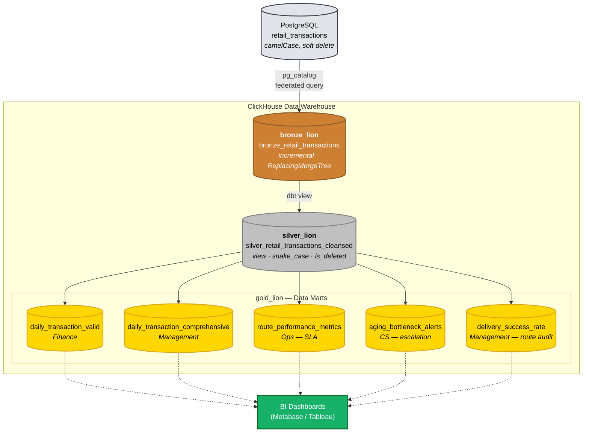

# Data Architecture — Lion Parcel ELT Data Warehouse

This document is the Architecture Decision Record (ADR) for the data layer: the design decisions taken, the alternatives rejected and why, the Medallion modelling (Bronze/Silver/Gold), and the limitations we know about.

Companion document: [INFRASTRUCTURE.md](INFRASTRUCTURE.md) — container topology, networking, Cosmos, alerting.

---

## 1. Executive Summary

**The problem:** move retail transactions from an operational database into a data warehouse every hour, synchronise soft deletes correctly, and expose the result as analytics tables that are ready to query.

**The solution:** a three-layer ELT on ClickHouse, driven by dbt and scheduled by Airflow, with no ingestion tool in between.

| Decision | Choice | Rejected alternative | Reasoning |
|---|---|---|---|
| Integration pattern | **ELT** | ETL | Raw data is kept intact, so a backfill is possible whenever business logic changes |
| Ingestion engine | **ClickHouse PostgreSQL Engine** | Airbyte / Fivetran / Debezium+Kafka | One `.sh` file, no extra containers, no queueing latency |
| Transformation | **dbt-clickhouse** | Hand-written SQL scripts | Lineage, `ref()`, data tests and documentation in a single artefact |
| Modelling | **Medallion** (Bronze→Silver→Gold) | Source straight to mart | Raw is preserved and cleansing logic is centralised in one place |
| Delete synchronisation | **`ReplacingMergeTree(updatedAt)` + `is_deleted` flag** | Hard delete / `ALTER TABLE DELETE` | History is never lost, upserts are automatic, no expensive mutations |
| Materialisation | Bronze `incremental` · Silver `view` · Gold `table` | Everything as `table` | Disk and compute are paid for only where they are actually needed |

**Measured state at the time of writing:** 225 Bronze rows feeding 5 Gold marts, with the whole pipeline (ingest + 3 layers + data tests) completing well inside a single hourly window.

---

## 2. Context & Requirements

| # | Requirement | How it is met |
|---|---|---|
| R1 | Move transaction data from the source database to the warehouse | `pg_catalog` (ClickHouse ↔ Postgres) plus the Bronze dbt model |
| R2 | Run **hourly** | The `lion_parcel_dbt_pipeline` DAG, `schedule="@hourly"` |
| R3 | Soft deletes at the source must synchronise | `deletedAt` travels with the row; `ReplacingMergeTree` supersedes the old version; Silver derives `is_deleted` |
| R4 | Normalise column names to `snake_case` | The Silver layer |
| R5 | Aggregates for business consumption | 5 marts in the Gold layer |
| R6 | Data quality enforced | 23 dbt tests (16 `unique`/`not_null` + 3 `accepted_values` + 4 singular tests), executed fail-fast per layer |

---

## 3. Architecture Decisions

### ADR-1 — ELT rather than ETL

All raw data lands in the warehouse unchanged in meaning, and transformation happens *after* the load.

- **Cheap backfills.** If the SLA formula changes, re-running `dbt run` over the Gold layer is enough. There is no need to re-extract from the operational system, which in the real world means no fresh access request, no additional load on a production database, and no dependency on the source's retention window.
- **Audit trail.** The `load_at` column in Bronze records when each row arrived, separately from the source's own `updatedAt`. When numbers disagree with another team, "when did this row land?" has an answer.
- **The trade-off we accept:** more storage, because raw data is kept. That is deliberately offset by the choice of ClickHouse (ADR-3).

### ADR-2 — Ingestion with no intermediate tool

ClickHouse creates a bridging database, `pg_catalog`, that maps PostgreSQL's `public` schema as native tables:

```sql
-- clickhouse/init/01_create_pg_catalog.sh (runs automatically on first container start)
CREATE DATABASE IF NOT EXISTS pg_catalog
ENGINE = PostgreSQL('postgres:5432', '${POSTGRES_DB}', '${POSTGRES_USER}', '${POSTGRES_PASSWORD}', 'public');
```

From then on, `SELECT ... FROM pg_catalog.retail_transactions` inside a dbt model is already a federated query into PostgreSQL. Credentials come from environment variables rather than being hardcoded.

**Why not Airbyte, Fivetran or Debezium?** For a single table on an hourly SLA, each of them adds at least two to four containers, a state store, and another failure surface, without delivering anything not already available. An `updatedAt`-based incremental filter is sufficient because the source has a trigger guaranteeing that column is always accurate (see §4).

**When this decision should be revisited:** if the source grows to dozens of tables; if the SLA tightens below a minute, which would require log-based CDC; or if hard `DELETE`s begin happening at the source, since `pg_catalog` cannot detect a row that has vanished.

### ADR-3 — ClickHouse as the OLAP engine

The standard objection to ELT is storage growth. ClickHouse answers it physically: columnar storage, per-column compression, and `LowCardinality` for repeated text. Columns such as `lastStatus` and `posOrigin`, which hold only a handful of distinct values, are stored as dictionary integers rather than repeated strings — saving disk while also speeding up `GROUP BY`, because the aggregation then operates over integers.

---

## 4. Source Data Contract (PostgreSQL)

```sql
-- postgres/postgres_init/init.sql
CREATE TABLE retail_transactions (
    "id"             VARCHAR(50) PRIMARY KEY,   -- Receipt ID
    "customerId"     VARCHAR(50),
    "lastStatus"     VARCHAR(50),               -- 6 enum values, see below
    "posOrigin"      VARCHAR(100),
    "posDestination" VARCHAR(100),
    "createdAt"      TIMESTAMPTZ DEFAULT CURRENT_TIMESTAMP,
    "updatedAt"      TIMESTAMPTZ DEFAULT CURRENT_TIMESTAMP,
    "deletedAt"      TIMESTAMPTZ NULL           -- populated = soft deleted
);

-- This trigger is the foundation of the entire incremental strategy:
CREATE TRIGGER trigger_update_timestamp
BEFORE UPDATE ON retail_transactions
FOR EACH ROW EXECUTE FUNCTION set_updated_at();  -- NEW."updatedAt" = CURRENT_TIMESTAMP
```

**The critical assumption a reviewer should know about:** the whole incremental strategy depends on `updatedAt` advancing on every change. The trigger above enforces that at the database level rather than in application code, so it cannot be forgotten by a backend developer. Remove that trigger and the pipeline starts losing data silently.

**Status lifecycle** (simulated by the `generate_retail_transactions` DAG):

```
BOOKED → PROCESSING → IN_TRANSIT → OUT_FOR_DELIVERY → DELIVERED → (soft delete: deletedAt set)
   └──────────────────────┴─────────────────┴──────→ CANCELLED
```

Two distinct notions of cancellation are deliberately kept apart and must **never** be conflated:

| Concept | Representation | Business meaning |
|---|---|---|
| Business cancellation | `lastStatus = 'CANCELLED'` | The customer or operations cancelled the delivery |
| System deletion | `deletedAt IS NOT NULL` | The record was archived or voided; the transaction still happened |

---

## 5. Data Flow



One source, one cleansing path, five marts. No Gold model touches Bronze directly — everything must pass through Silver, which makes it impossible for two dashboards to hold two different definitions of "valid transaction".

---

## 6. Bronze Layer — `bronze_lion.bronze_retail_transactions`

*Raw landing zone. Structurally one-to-one with the source (still camelCase), with only `load_at` metadata added.*

### 6.1 dbt configuration

```sql
{{ config(
    materialized='incremental',
    schema='bronze_lion',
    engine='ReplacingMergeTree(updatedAt)',
    unique_key='id',
    order_by=['toDate(updatedAt)', 'lastStatus', 'id'],
    partition_by=['toYYYYMM(createdAt)'],
    settings={'allow_nullable_key': 1}
) }}
```

### 6.2 Physical DDL as executed (taken from `SHOW CREATE TABLE`)

```sql
CREATE TABLE bronze_lion.bronze_retail_transactions
(
    `id`             String,
    `customerId`     Nullable(String),
    `lastStatus`     LowCardinality(Nullable(String)),
    `posOrigin`      LowCardinality(Nullable(String)),
    `posDestination` LowCardinality(Nullable(String)),
    `createdAt`      Nullable(DateTime64(6)),
    `updatedAt`      DateTime64(6),               -- NOT NULL: the engine's version column
    `deletedAt`      Nullable(DateTime64(6)),
    `load_at`        DateTime                      -- metadata: when the row reached the warehouse
)
ENGINE = ReplacingMergeTree(updatedAt)
PARTITION BY (toYYYYMM(createdAt))
ORDER BY (toDate(updatedAt), lastStatus, id)
SETTINGS allow_nullable_key = 1;
```

### 6.3 Four physical decisions and their reasoning

| Decision | Reasoning |
|---|---|
| `ReplacingMergeTree(updatedAt)` | Automatic deduplication by sorting key; when two versions of a row exist, the one with the greatest `updatedAt` wins. This is what makes re-running the pipeline **idempotent**. |
| `ORDER BY (toDate(updatedAt), lastStatus, id)` | ClickHouse's sparse primary index. The order is deliberate: time first (most frequently filtered), then the filter column, then the unique id as a tiebreaker. Avoids full scans. |
| `PARTITION BY toYYYYMM(createdAt)` | Physical separation by month. Retention and TTL become a `DROP PARTITION` — instant and metadata-only — instead of an expensive `DELETE`. |
| `LowCardinality(Nullable(String))` | Dictionary encoding for repetitive columns (status, city). Shrinks disk footprint and accelerates `GROUP BY` in Gold. |
| `allow_nullable_key = 1` | A reasonable consequence: `createdAt` and `lastStatus` are nullable at the source yet serve as partition and sorting keys. `updatedAt` is wrapped in `assumeNotNull()` because a version column cannot be nullable. |

### 6.4 Incremental strategy and soft-delete synchronisation (the heart of R3)

```sql
SELECT
    id, "customerId",
    CAST("lastStatus"     AS LowCardinality(Nullable(String))) AS lastStatus,
    CAST("posOrigin"      AS LowCardinality(Nullable(String))) AS posOrigin,
    CAST("posDestination" AS LowCardinality(Nullable(String))) AS posDestination,
    "createdAt",
    assumeNotNull("updatedAt") AS updatedAt,
    "deletedAt",
    now() AS load_at
FROM {{ source('postgres_source', 'retail_transactions') }}


    WHERE "updatedAt" >= (SELECT max(updatedAt) FROM {{ this }})

```

**How it works, step by step:**

1. **First run** — `is_incremental()` is false, so the whole table is pulled (full load).
2. **Subsequent runs** — only rows with `updatedAt >= watermark` cross the network. The source trigger guarantees that every insert, status update *and* soft delete advances `updatedAt`, so all three kinds of change are captured by the same single filter.
3. **A soft delete arrives as an ordinary UPDATE.** When `deletedAt` is populated in PostgreSQL, the trigger raises `updatedAt`, so the row passes the incremental filter and lands in Bronze as a new version with `deletedAt` set. The old row is **not physically deleted**; `ReplacingMergeTree` collapses the two. History is preserved and synchronisation is achieved.

**Why `>=` and not `>`?**

This is a deliberate choice. With `>`, a row committed in the **exact same millisecond** as the watermark would be missed forever — silent data loss, the most expensive class of bug to track down. With `>=`, the boundary is safe but edge rows are pulled twice. Those duplicates are handled in two layers:

- **Layer 1 — `unique_key='id'`.** The `dbt-clickhouse` adapter runs a `delete+insert` strategy: rows with matching ids are removed before the new batch is inserted, within one logical transaction. Duplicates disappear immediately.
- **Layer 2 — `ReplacingMergeTree`.** An engine-level safety net that works during background merges.

The principle: **re-reading a little data is better than losing a single row.** Duplication costs a small amount of I/O; lost data costs a wrong number in a report that nobody notices.

> **Operational note:** `ReplacingMergeTree` deduplication is *eventual* — it happens at merge time, not at insert time. For ad-hoc reads against Bronze before a merge completes, use `SELECT ... FROM bronze_retail_transactions FINAL`. The production path is unaffected because `unique_key` already resolves it in layer 1.

---

## 7. Silver Layer — `silver_lion.silver_retail_transactions_cleansed`

*The single source of truth, and the only place where "clean" is defined.*

```sql
{{ config(materialized='view', schema='silver_lion') }}

SELECT
    trim(id)                    AS id,
    trim("customerId")          AS customer_id,
    upper(trim("lastStatus"))   AS last_status,     -- text standardisation
    trim("posOrigin")           AS pos_origin,
    trim("posDestination")      AS pos_destination,
    "createdAt"                 AS created_at,
    "updatedAt"                 AS updated_at,
    "deletedAt"                 AS deleted_at,
    load_at,
    IF("deletedAt" IS NOT NULL, 1, 0) AS is_deleted -- derived flag
FROM {{ ref('bronze_retail_transactions') }}
```

**This layer has exactly three responsibilities**, deliberately constrained so it never becomes a dumping ground for business logic:

1. **Naming normalisation** — camelCase to snake_case, satisfying R4. Warehouse column names are no longer bound to backend conventions.
2. **Value standardisation** — `upper(trim(...))` eliminates the entire class of bug where `"delivered"`, `"DELIVERED "` and `"Delivered"` count as three different statuses.
3. **The derived `is_deleted` flag** — turning a repeated `deletedAt IS NOT NULL` null-check into an integer comparison, `is_deleted = 0`. Faster, and more importantly: **analysts no longer need to remember soft-delete semantics.**

**Why a `view` rather than a `table`?** Zero extra bytes on disk and zero materialisation time. `trim()` and `upper()` are vectorised operations that are effectively free in ClickHouse. As long as Silver contains only row-by-row transformations, with no joins or window functions, a `view` is the correct choice.

**When to switch it to a `table`:** once Silver starts joining to other dimensions, or once the number of Gold models grows enough that Bronze is being re-scanned too often per run.

---

## 8. Gold Layer — `gold_lion.*`

*The consumption layer, entirely `materialized='table'`.*

Aggregation cost is paid once during `dbt run` rather than repeatedly every time a dashboard opens. The marts are deliberately small and purpose-built (micro-marts) rather than one large do-everything table, so each query reads only the relevant columns and `ORDER BY` can be tuned to each audience's filtering pattern.

### 8.1 The five marts at a glance

| Mart | Owner / audience | Question it answers | Key filter | `ORDER BY` |
|---|---|---|---|---|
| `gold_daily_transaction_valid` | Finance & Ops | "How many valid transactions per day?" | `is_deleted=0` **and** `last_status != 'CANCELLED'` | `transaction_date, last_status` |
| `gold_daily_transaction_comprehensive` | Management | "What was total parcel movement, cancellations included?" | *(no filter)* | `transaction_date, last_status` |
| `gold_route_performance_metrics` | Operations Director | "Which route is slowest?" | `last_status='DELIVERED'`, `is_deleted=0` | `pos_origin, pos_destination` |
| `gold_aging_bottleneck_alerts` | Warehouse & Customer Service | "Which parcels are stuck right now?" | Active status, `is_deleted=0`, stuck ≥ 12 hours | `last_status, pos_origin` |
| `gold_delivery_success_rate` | Management | "How reliable is each route?" | `is_deleted=0` | `pos_origin, pos_destination` |

**Why keep `valid` and `comprehensive` apart instead of one table with a flag?** Because they answer different questions and **both are correct**. Finance must not count cancelled transactions as revenue; Management specifically needs the cancellation count to gauge operational health. Merging them into one table forces every consumer to remember which filter to apply, and sooner or later somebody forgets. Splitting them makes that mistake impossible.

### 8.2 Model details

#### (1) `gold_daily_transaction_valid` — the basis for revenue figures

```sql
{{ config(materialized='table', schema='gold_lion',
          order_by=['transaction_date', 'last_status'],
          settings={'allow_nullable_key': 1}) }}
SELECT
    toDate(created_at) AS transaction_date,
    last_status, pos_origin, pos_destination,
    count(id)          AS total_valid_transactions,
    now()              AS processed_at
FROM {{ ref('silver_retail_transactions_cleansed') }}
WHERE is_deleted = 0
  AND last_status != 'CANCELLED'
GROUP BY transaction_date, last_status, pos_origin, pos_destination
```

Both exclusions (`is_deleted` and `CANCELLED`) are applied together because they are distinct concepts (see §4) and neither counts as revenue.

#### (2) `gold_daily_transaction_comprehensive` — the complete recap

```sql
{{ config(materialized='table', schema='gold_lion',
          order_by=['transaction_date', 'last_status'],
          settings={'allow_nullable_key': 1}) }}
SELECT
    toDate(created_at) AS transaction_date,
    last_status, pos_origin, pos_destination,
    count(id)              AS total_transactions,
    countIf(is_deleted = 1) AS total_soft_deleted,
    now()                  AS processed_at
FROM {{ ref('silver_retail_transactions_cleansed') }}
GROUP BY transaction_date, last_status, pos_origin, pos_destination
```

**Why count only soft deletes rather than "cancelled or deleted"?** Because `last_status` is already part of the grouping key. A column defined as `countIf(last_status = 'CANCELLED' OR is_deleted = 1)` at this grain would always equal `total_transactions` on `CANCELLED` rows while counting only soft deletes elsewhere — technically correct, impossible to read consistently, and outright wrong if summed across statuses.

Both metrics remain fully recoverable, each without ambiguity:

| Question | How to read it |
|---|---|
| How many transactions were cancelled today? | `sumIf(total_transactions, last_status = 'CANCELLED')` |
| How many transactions were system-deleted today? | `sum(total_soft_deleted)` |

Both have been reconciled against Silver: 44 = 44 for cancellations, 24 = 24 for soft deletes.

#### (3) `gold_route_performance_metrics` — end-to-end SLA

```sql
{{ config(materialized='table', schema='gold_lion',
          order_by=['pos_origin', 'pos_destination'],
          settings={'allow_nullable_key': 1}) }}
SELECT
    pos_origin, pos_destination,
    count(id) AS total_delivered_packages,
    round(avg(dateDiff('hour', created_at, updated_at)), 2) AS avg_delivery_time_hours,
    min(dateDiff('hour', created_at, updated_at))           AS fastest_delivery_hours,
    max(dateDiff('hour', created_at, updated_at))           AS slowest_delivery_hours,
    now() AS processed_at
FROM {{ ref('silver_retail_transactions_cleansed') }}
WHERE last_status = 'DELIVERED' AND is_deleted = 0
GROUP BY pos_origin, pos_destination
ORDER BY total_delivered_packages DESC
```

**A metric definition worth understanding:** for a `DELIVERED` row, `updated_at` is the time of the final status change, which is when the parcel was marked as arrived. So `dateDiff('hour', created_at, updated_at)` is the lead time from booking to arrival.

That definition holds **precisely because** `is_deleted = 0` appears in the `WHERE` clause. If an already-`DELIVERED` parcel is later soft-deleted, the trigger raises `updated_at` once more and the lead time inflates falsely. The filter discards those rows. This is a case where two seemingly unrelated filters actually support each other — remove one and the metric breaks silently.

Including `min` and `max` alongside `avg` is deliberate: averages hide outliers, and what management usually asks is "how long did the slowest parcel take?".

#### (4) `gold_aging_bottleneck_alerts` — the stuck-parcel radar

```sql
{{ config(materialized='table', schema='gold_lion',
          order_by=['last_status', 'pos_origin'],
          settings={'allow_nullable_key': 1}) }}
SELECT
    last_status, pos_origin, pos_destination,
    count(id) AS total_stuck_packages,
    round(avg(dateDiff('hour', updated_at, now())), 2) AS avg_hours_stuck,
    max(dateDiff('hour', updated_at, now()))           AS max_hours_stuck,
    now() AS processed_at
FROM {{ ref('silver_retail_transactions_cleansed') }}
WHERE last_status NOT IN ('DELIVERED', 'CANCELLED')
  AND is_deleted = 0
  AND dateDiff('hour', updated_at, now()) >= 12
GROUP BY last_status, pos_origin, pos_destination
ORDER BY total_stuck_packages DESC, avg_hours_stuck DESC
```

The only mart that is **action-oriented rather than reporting-oriented**: its contents are a work queue for the customer service team. The 12-hour threshold marks the point at which a delay deserves escalation; it is a strong candidate for promotion to a dbt `var` so it can be tuned per route without touching code.

An empty table here means a healthy operation, not a failed pipeline.

#### (5) `gold_delivery_success_rate` — route reliability audit

```sql
{{ config(materialized='table', schema='gold_lion',
          order_by=['pos_origin', 'pos_destination'],
          settings={'allow_nullable_key': 1}) }}
SELECT
    pos_origin, pos_destination,
    count(id)                          AS total_packages,
    countIf(last_status = 'DELIVERED') AS total_delivered,
    countIf(last_status = 'CANCELLED') AS total_cancelled,
    round((countIf(last_status = 'DELIVERED') / count(id)) * 100, 2) AS success_rate_pct,
    round((countIf(last_status = 'CANCELLED') / count(id)) * 100, 2) AS cancelled_rate_pct,
    now() AS processed_at
FROM {{ ref('silver_retail_transactions_cleansed') }}
WHERE is_deleted = 0
GROUP BY pos_origin, pos_destination
HAVING total_packages > 0
ORDER BY total_packages DESC
```

**How the denominator is defined:** `total_packages` covers every valid transaction on that route, including parcels still in transit and those cancelled. Consequently `success_rate_pct` is a percentage of every parcel that ever entered the route, not only those that finished. The figure will look lower on routes with many in-flight parcels, so it should always be read alongside `total_packages`. The `HAVING total_packages > 0` clause prevents division by zero.

### 8.3 Mart data dictionary

| Column | Type | Present in | Meaning |
|---|---|---|---|
| `transaction_date` | `Date` | valid, comprehensive | `created_at` truncated to a date |
| `last_status` | `LowCardinality(Nullable(String))` | valid, comprehensive, aging | Latest status, already uppercased |
| `pos_origin` / `pos_destination` | `LowCardinality(Nullable(String))` | all | Origin and destination city |
| `total_valid_transactions` | `UInt64` | valid | Count of valid transactions |
| `total_transactions` | `UInt64` | comprehensive | Count of all transactions |
| `total_soft_deleted` | `UInt64` | comprehensive | System deletions at this grain. Business cancellations are read from rows where `last_status = 'CANCELLED'` |
| `avg_delivery_time_hours` | `Float64` | route_performance | Mean lead time in hours |
| `fastest_/slowest_delivery_hours` | `Int64` | route_performance | Fastest and slowest lead time |
| `total_stuck_packages` | `UInt64` | aging | Parcels stuck for 12 hours or more |
| `avg_/max_hours_stuck` | `Float64` / `Int64` | aging | Time stuck since the last update |
| `success_rate_pct` / `cancelled_rate_pct` | `Float64` | success_rate | Percentage between 0 and 100 |
| `processed_at` | `DateTime` | all | When the mart was last built (a freshness indicator) |

`processed_at` exists in every mart so dashboard consumers can tell "the number is zero" apart from "the data has not been refreshed".

---

## 9. Orchestration & Data Quality

### 9.1 Offset scheduling

| DAG | Schedule | Role |
|---|---|---|
| `generate_retail_transactions` | `55 * * * *` | Simulates the operational system: inserts, status transitions, soft deletes |
| `lion_parcel_dbt_pipeline` | `@hourly` (minute 0) | Bronze → Silver → Gold plus every data test |

The five-minute offset ensures all source transactions have committed before aggregation starts, so no run window ever reads half-written data.

### 9.2 Task flow

```
start → check_new_data → dbt_process (Cosmos TaskGroup) → end
```

**`check_new_data` (a `ShortCircuitOperator`)** asks PostgreSQL directly whether any row has `updatedAt >= data_interval_start`. If not, the entire dbt TaskGroup is skipped — a quiet hour does not spend compute rebuilding five Gold tables that have not changed. Manual triggers from the UI deliberately bypass this check so demos and backfills are not skipped along with it.

**`DbtTaskGroup` (Astronomer Cosmos)** turns every dbt model and every dbt test into a separate Airflow task, so failures are visible at model level rather than inside one opaque task called "dbt run".

- `LoadMode.DBT_MANIFEST` — the graph is built from a `manifest.json` generated during `docker build`, not from repeated `dbt parse` calls in the scheduler.
  **Operational consequence:** any added or renamed dbt model **requires** a `docker compose build`; editing files through the bind mount alone will not surface new tasks.
- `TestBehavior.AFTER_EACH` — each test runs immediately after its own model. If a Bronze test goes red, Silver and Gold do **not** run (fail-fast), so incorrect data never reaches a dashboard, and the Telegram notification names the failed task.

### 9.3 Data quality as code

Validation is not delegated to PostgreSQL constraints. It is written in `models/schema.yml`, so it is version-controlled, reviewed, and executed automatically on every run.

| Test | Applied to | Problem it catches |
|---|---|---|
| `unique` + `not_null` | `bronze.id`, `silver.id` | Duplication introduced by the incremental load, or a missing primary key |
| `accepted_values` (6 statuses) | `bronze.lastStatus`, `silver.last_status` | An unexpected status from the source (a typo such as `'DELIVRED'`), or a leak in Silver's normalisation |
| `accepted_values` (0/1) | `silver.is_deleted` | Broken derived-flag logic |
| `not_null` | every Gold key and metric column | Aggregations silently producing NULLs |

The `accepted_values` test on Silver is not a duplicate of the Bronze one: Bronze tests the **source contract**, Silver tests the **transformation result**. If `upper(trim(...))` ever breaks, only the Silver test goes red — and that points straight at the cause.

---

## 10. Known Limitations & Improvement Plan

This section is documented deliberately: every system has limits, and a limit written down is far cheaper than a limit discovered during an incident.

| ID | Limitation | Impact | Plan |
|---|---|---|---|
| **L-1** | `gold_aging_bottleneck_alerts` can legitimately be empty, so the `not_null` test above it passes vacuously | A regression in this mart goes undetected as long as no parcel is stuck | Add a scenario with synthetic stuck data, or run the test against a separate fixture dataset |
| **L-2** | `pg_catalog` cannot detect a hard `DELETE` at the source | Hard-deleted rows would linger in Bronze forever | Safe while the soft-delete contract holds (§4). If it changes, add a daily id-based reconciliation |
| **L-3** | `ReplacingMergeTree` deduplication is eventual | Ad-hoc queries against Bronze before a merge can see duplicates | Use `FINAL` for manual reads; the production path is already safe via `unique_key` |
| **L-4** | Every Gold mart is fully rebuilt (`table`) each hour | Cost grows linearly with history volume | Convert the daily marts to `incremental` on a date partition once data passes the tens-of-millions range |
| **L-5** | The 12-hour threshold in `aging_bottleneck_alerts` is hardcoded | Route-specific SLAs are not accommodated | Promote it to a dbt `var`, then a per-route SLA table as a seed |
| **L-6** | Silver is a `view`, re-read by all 5 marts | Bronze is scanned five times per run | Switch it to a `table` if the mart count grows significantly |

---

## 11. How to Verify

The commands below can be run directly to substantiate the claims in this document.

```bash
# Bronze physical structure (engine, partitioning, sorting key)
docker exec lion_clickhouse clickhouse-client -u lion_user --password lion_password \
  -q "SHOW CREATE TABLE bronze_lion.bronze_retail_transactions"

# Inventory of every layer with row counts
docker exec lion_clickhouse clickhouse-client -u lion_user --password lion_password -q "
  SELECT database, name, engine, total_rows
  FROM system.tables
  WHERE database IN ('bronze_lion','silver_lion','gold_lion')
  ORDER BY database, name"
```

```sql
-- Proof of soft-delete synchronisation: rows deleted at the source remain in the
-- warehouse, with deletedAt intact and is_deleted correctly set to 1
SELECT id, last_status, deleted_at, is_deleted, updated_at, load_at
FROM silver_lion.silver_retail_transactions_cleansed
WHERE is_deleted = 1
ORDER BY updated_at DESC
LIMIT 10;

-- Proof of idempotency: no duplicate ids after repeated incremental runs
SELECT count() AS duplicates
FROM (
    SELECT id FROM bronze_lion.bronze_retail_transactions FINAL
    GROUP BY id HAVING count() > 1
);
-- Expected result: 0

-- Cross-mart consistency: valid transactions never exceed the overall total.
-- The two marts are aggregated separately and then unioned rather than JOINed,
-- because joining on only part of the grain would fan out rows and inflate both sides.
SELECT
    transaction_date,
    sumIf(n, src = 'valid') AS valid,
    sumIf(n, src = 'total') AS total
FROM (
    SELECT transaction_date, 'valid' AS src, total_valid_transactions AS n
    FROM gold_lion.gold_daily_transaction_valid
    UNION ALL
    SELECT transaction_date, 'total' AS src, total_transactions AS n
    FROM gold_lion.gold_daily_transaction_comprehensive
)
GROUP BY transaction_date
ORDER BY transaction_date DESC;
-- Expected invariant: valid <= total on every date
```
