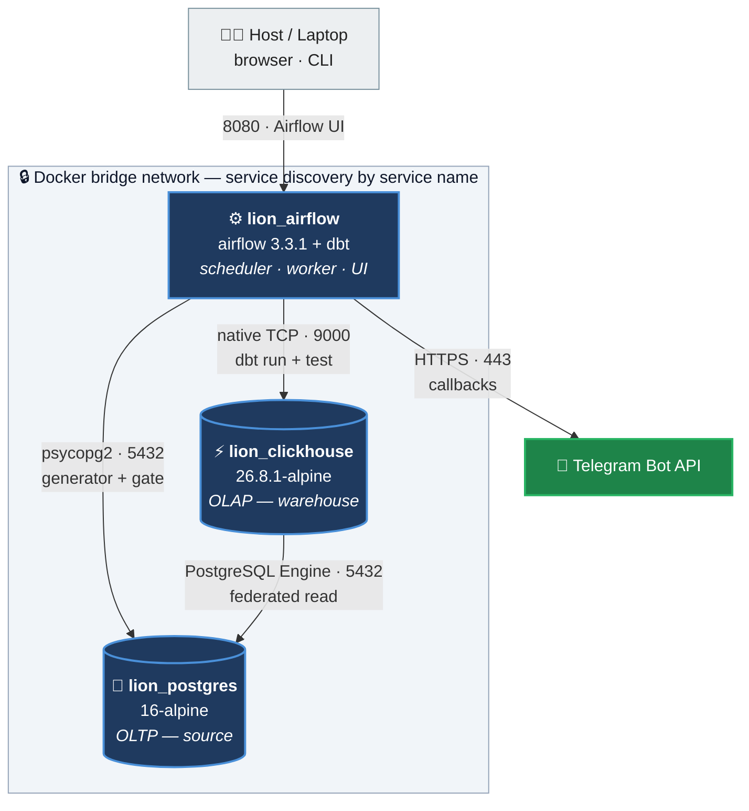
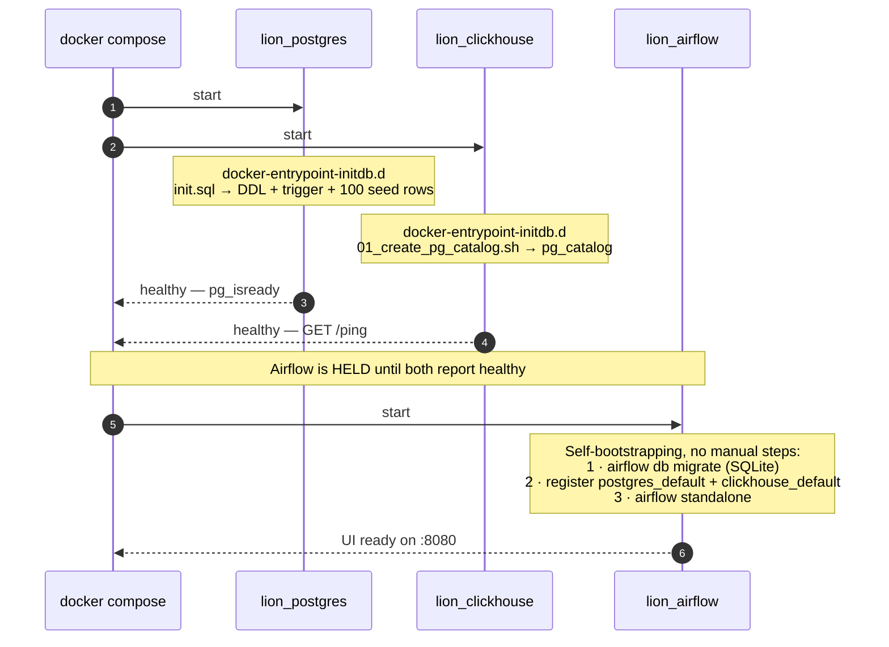

# Infrastructure Architecture — Lion Parcel ELT

This document describes the runtime topology, container management, state persistence, build strategy and security posture of the Lion Parcel data warehouse stack.

**An honest framing:** this infrastructure is **local-first** — a single `docker compose up` brings the whole stack alive on a reviewer's laptop with no cloud dependency. It is **not** production-ready, and that is deliberate: §8 lists the limitations explicitly, and §9 maps out what must change for production. Claiming otherwise would collapse under the first question asked.

Companion document: [DATA_ARCHITECTURE.md](DATA_ARCHITECTURE.md) — ADRs, Medallion modelling, DDL, ClickHouse optimisations.

---

## 1. Runtime Topology

Three containers are orchestrated by `compose.yml` and talk to each other over the **default Docker Compose bridge network** — each service reaches the others by DNS name (`postgres`, `clickhouse`, `airflow`), never by IP address.



> The diagram shows the paths the pipeline actually uses. Direct host-to-database access for debugging is deliberately left out so the main flow stays readable; those ports are listed in the table below.

**Ports published to the host:**

| Service | Port | Protocol | Purpose |
|---|---|---|---|
| `lion_airflow` | `8080` | HTTP | Airflow UI (`admin` / `admin`) |
| `lion_postgres` | `5432` | PostgreSQL wire | Manual inspection of the source |
| `lion_clickhouse` | `8123` | HTTP | Queries and monitoring from external tools |
| `lion_clickhouse` | `9000` | Native TCP | **Required** — `dbt-clickhouse` speaks this protocol, not HTTP |

The pipeline itself only needs container-to-container traffic inside the network. All three published ports exist purely for inspection convenience — see §8 for the security implications.

---

## 2. Boot Order & Readiness Gating

The classic failure of a multi-container stack is a race condition: the orchestrator starts before the databases accept connections, the first run fails, and a false alert goes out. `depends_on` with `condition: service_healthy` closes that gap.



The init scripts in steps 3–4 only run **while the data directory is still empty** — standard behaviour of the official Postgres and ClickHouse images. Running `compose up` against existing data overwrites nothing.

---

## 3. Node Specifications

### A. `lion_postgres` — OLTP / Source

| Aspect | Value |
|---|---|
| Image | `postgres:16-alpine` |
| Initialisation | `postgres_init/init.sql` — DDL, the `set_updated_at()` function, the `updatedAt` trigger, 100 seed rows |
| Storage | Bind mount `./postgres/pg_data` |
| Healthcheck | `pg_isready -U $POSTGRES_USER -d $POSTGRES_DB` every 10 seconds |

The `updatedAt` trigger is not a convenience: the entire Bronze incremental strategy depends on it. Enforcing it at the database level means the application cannot forget to maintain it. Details in [DATA_ARCHITECTURE.md §4](DATA_ARCHITECTURE.md).

### B. `lion_clickhouse` — OLAP / Data Warehouse

| Aspect | Value |
|---|---|
| Image | `clickhouse/clickhouse-server:26.8.1-alpine` — **pinned**, not `latest`, so builds are reproducible |
| Source integration | `01_create_pg_catalog.sh` creates the `pg_catalog` database with `ENGINE = PostgreSQL(...)`; credentials come from environment variables rather than being hardcoded |
| Storage | Bind mount `./clickhouse/ch_data` |
| Healthcheck | `wget -qO- http://127.0.0.1:8123/ping` |

The healthcheck deliberately hits an HTTP endpoint instead of merely checking that the process is alive: ClickHouse only answers `/ping` once it is genuinely ready to serve queries.

The largest architectural consequence is that Bronze ingestion needs neither Kafka, Debezium, nor Airbyte. The full reasoning is in [DATA_ARCHITECTURE.md ADR-2](DATA_ARCHITECTURE.md).

### C. `lion_airflow` — Orchestrator

| Aspect | Value |
|---|---|
| Image | Custom, from `apache/airflow:3.3.1` + dbt-core 1.12.3 + dbt-clickhouse 1.9.3 + Cosmos 1.15.1 (~2.6 GB) |
| Command | `airflow standalone` — runs api-server, scheduler, triggerer, dag-processor and worker in one container |
| Executor | `LocalExecutor` |
| Metadata DB | SQLite at `/opt/airflow/airflow.db` |
| Timezone | `AIRFLOW__CORE__DEFAULT_TIMEZONE=Asia/Jakarta`, aligned with Postgres and ClickHouse |
| Auth | `SimpleAuthManager`; the password is written to `simple_auth_manager_passwords.json.generated` at start |

**Self-bootstrapping.** The startup script rebuilds Airflow's entire state from scratch on every boot: `db migrate`, then registering `postgres_default` and `clickhouse_default` from environment variables. There are no manual steps and no connections to import through the UI.

**Concurrency tuning.** `AIRFLOW__CORE__MAX_ACTIVE_TASKS_PER_DAG` is read from `.env` (default **4**). The other knobs (`PARALLELISM`, `MIN_FILE_PROCESS_INTERVAL`, `DAG_DIR_LIST_INTERVAL`) are deliberately left commented out in `compose.yml` as ready-made tuning points — DAG parsing overhead is already suppressed by `LoadMode.DBT_MANIFEST` (§5), so slowing the scheduler down is not yet warranted.

> **A real limit of SQLite + LocalExecutor:** SQLite locks the entire file on write. Under higher concurrency, parallel tasks can collide (`database is locked`). With two DAGs and `MAX_ACTIVE_TASKS_PER_DAG=4` this does not occur, but that number must **not** be raised without first moving the metadata database to PostgreSQL (§9).

---

## 4. State Persistence

Not all state in this system lives equally long. The table below answers "what do I lose if I do X":

| State | Location | Survives `restart` | Survives `down` | Notes |
|---|---|---|---|---|
| Postgres source data | `./postgres/pg_data` (bind mount) | ✅ | ✅ | Delete the directory to re-seed from scratch |
| ClickHouse warehouse data | `./clickhouse/ch_data` (bind mount) | ✅ | ✅ | Holds every Bronze/Silver/Gold table |
| DAG, dbt, include and test code | bind mounts from the host | ✅ | ✅ | The repo is the source of truth, not the container |
| Airflow task logs | `airflow_logs` (named Docker volume) | ✅ | ✅ | Removed only by `docker compose down -v`. See the note below on why this is not a bind mount |
| **Airflow metadata** (run history, XCom, DAG state) | `/opt/airflow/airflow.db` — **container layer** | ✅ | ❌ | Deliberately not mounted |
| Connections and admin password | rebuilt at startup | — | — | Idempotent; nothing to restore |

> **Why the Airflow logs are a named volume rather than a bind mount.** The Airflow container runs as uid 50000, while a directory produced by `git clone` belongs to the host user with mode 755. Mounting that directory over `/opt/airflow/logs` leaves uid 50000 unable to write, and Airflow fails to start on a freshly cloned repository — while working fine on the original machine, whose directory happened to be more permissive. A named volume sidesteps the problem entirely: Docker seeds it with the image's own ownership (`airflow:root`), so it works on any machine with no manual `chmod` step. The trade-off is that logs are no longer at a host path; read them through the Airflow UI or with `docker exec`.

**Why is Airflow metadata deliberately non-persistent?** During local development the DAG structure changes aggressively. Airflow stores DAGs in serialised form, and a rapid series of structural changes can leave stale metadata out of sync with the new code. Letting SQLite disappear on `down` means every cycle starts from a clean state. The only thing sacrificed is **execution history** — not data, not code, not configuration, all of which are rebuilt automatically at startup.

This is the right call for an assessment environment and the wrong one for production. A replacement line is available (commented out) in `compose.yml`; §9 covers what to swap it for.

---

## 5. Build Pipeline & Cosmos Optimisation

The biggest challenge of dbt + Airflow via Cosmos is *parsing overhead*: by default the scheduler runs `dbt parse` repeatedly (every 30 seconds by default) purely to draw the TaskGroup.

**The fix — move parsing to build time.** Inside the `Dockerfile`:

1. A *dummy* dbt profile is created with fake host and credentials — `dbt parse` only reads the project structure and never touches the warehouse.
2. `dbt parse` runs to produce a static `manifest.json`.
3. The manifest is written to `/opt/airflow/dbt_manifest`, **outside** `/opt/airflow/dbt`, so it is not shadowed by the host bind mount.

At runtime, Cosmos uses `LoadMode.DBT_MANIFEST` — the task graph is drawn purely from static JSON, with no repeated subprocess.

> `dbt deps` is deliberately not called: this project has no `packages.yml`, so the command would do nothing. Add it back once dbt package dependencies exist.

**Build context.** `compose.yml` uses `build: ./airflow-dbt`, so Docker reads `airflow-dbt/.dockerignore` — not the one at the repository root. That file excludes the host's `target/`, `logs/` and `dbt_packages/` so local run artefacts are never baked into the image.

> ⚠️ **A consequence every operator must know:** the manifest is a build-time snapshot. Adding or renaming a dbt model **without `docker compose build`** means the model is never executed — and no error is raised. This trap is closed by the automated test `test_dbt_taskgroup_covers_every_model` (§6).

---

## 6. Testing Strategy

Two complementary layers, both runnable without opening the UI:

| Layer | Tooling | Coverage | Command |
|---|---|---|---|
| **DAG structure** | pytest — 24 tests | Clean imports, DAG conventions (tags, retries, catchup, paused, owner, timezone, callbacks), Cosmos render completeness, the `check_new_data` gate | `docker exec -u airflow lion_airflow pytest /opt/airflow/tests/dags/ -q` |
| **Data quality** | dbt — 23 data tests | `unique` / `not_null` / `accepted_values` per layer, plus 4 singular tests for business invariants | `dbt build`, and automatically on every DAG run via `TestBehavior.AFTER_EACH` |

The structural layer is **static** — it touches neither Postgres nor ClickHouse, so it runs safely in CI without starting the warehouse at all.

`TestBehavior.AFTER_EACH` runs each test immediately after its own model: if a Bronze test goes red, Silver and Gold never run at all (fail-fast), so bad data never reaches a dashboard.

---

## 7. Alerting

`on_failure_callback` and `on_success_callback` are attached at DAG level on both production DAGs, calling `include/telegram_sender.py` through `TelegramHook`.

**Notification contents** (exactly what the code sends):

| Field | Source |
|---|---|
| DAG name | `context["dag"].dag_id` |
| List of failed tasks | `dag_run.get_task_instances(state="failed")` — failure messages only |
| Run time | `logical_date`, converted to Asia/Jakarta |
| Duration | The DagRun's `end_date − start_date` |
| Environment | Airflow Variable `environment` (default `dev`) |
| Direct link | `{host_url}/dags/{dag_id}/grid` |

> Notifications carry **the failed task names plus a link to the grid view**, not the stack trace. This is deliberate: raw error text is often long and can contain credential fragments. The engineer follows the link to read the full log. Delivery is blocking inside the callback — adequate for two DAGs, and worth revisiting as the DAG count grows.

**Activation (plug-and-play).** The code is already wired in; only two Variables need adding under **Admin ➡️ Variables** in the Airflow UI:

1. `telegram_token` — the API token from BotFather.
2. `telegram_chat_id` — the data team's group id (for example `-100123456789`).

Optional: `host_url`, so links point at the correct host, and `environment`, which labels messages `dev` or `prod`.

If the two required Variables are missing, the callback raises an error when the task finishes. That is intentional — alerting that fails silently is far more dangerous than alerting that fails loudly.

---

## 8. Security Posture & Known Limitations

Listed openly; each item is a deliberate decision for a local assessment context, not an oversight.

| ID | Condition | Risk | Applies to |
|---|---|---|---|
| **S-1** | Default credentials (`lion_user`/`lion_password`, `admin`/`admin`) in `.env` and `env.example` | Guessable credentials | Local only |
| **S-2** | Ports `5432`, `8123`, `9000` published to `0.0.0.0` | Databases reachable from any host on the same network | Local only |
| **S-3** | `profiles.yml` in the repo holds the ClickHouse password in plain text | Credentials enter version control | Used only for manual `dbt run`; Cosmos uses an Airflow Connection |
| **S-4** | `SimpleAuthManager` without TLS | UI credentials travel unencrypted | Local only |
| **I-1** | Airflow metadata in SQLite | Run history lost on `down`; limited write concurrency | See §4 |
| **I-2** | Every Airflow component in one container | No failure isolation between components | Appropriate at this scale |
| **I-3** | No CPU or memory limits on containers | A heavy query can exhaust host resources | Add `deploy.resources` if needed |

---

## 9. Path to Production

What must change if this stack moves to a real environment, in priority order:

| Priority | Change | Reason |
|---|---|---|
| 1 | Airflow metadata → **PostgreSQL** instead of SQLite | Removes the write-concurrency limit and makes run history persistent. The replacement line is already present, commented out, in `compose.yml` |
| 2 | Credentials → a **secret manager** (Vault / AWS Secrets Manager); remove `profiles.yml` from the repo | Closes S-1 and S-3 |
| 3 | Stop publishing ports `5432`/`8123`/`9000`; reach them via bastion or VPN | Closes S-2 |
| 4 | Replace `airflow standalone` with separate components (api-server, scheduler, triggerer, worker) | Failure isolation and independent scaling; closes I-2 |
| 5 | Bind mounts → **managed volumes** (EBS/EFS, or named Docker volumes) | Bind mounts are tied to host paths and host permissions |
| 6 | TLS in front of the Airflow UI plus a real auth manager (OAuth/LDAP) | Closes S-4 |
| 7 | `deploy.resources` limits per container | Closes I-3 |

The application design itself needs no change: the DAGs, dbt models and manifest strategy stay exactly as they are. Only the infrastructure layer beneath them moves.

---

## 10. Operational Runbook

```bash
# Bring up the whole stack (Airflow waits for Postgres and ClickHouse to be healthy)
docker compose up -d

# REQUIRED whenever a dbt model is added or renamed — the manifest is built at build time
docker compose build && docker compose up -d

# Check container readiness
docker compose ps

# Run both testing layers
docker exec -u airflow lion_airflow pytest /opt/airflow/tests/dags/ -q
docker exec -u airflow lion_airflow bash -c \
  "cd /opt/airflow/dbt/lion_parcel_project && dbt build --profiles-dir . --target prod \
   --log-path /tmp/dbtlogs --target-path /tmp/dbttarget"

# Inspect the warehouse
docker exec lion_clickhouse clickhouse-client -u lion_user --password lion_password \
  -q "SELECT database, name, engine, total_rows FROM system.tables \
      WHERE database IN ('bronze_lion','silver_lion','gold_lion') ORDER BY database, name"

# Airflow task logs (named volume — read via the UI or straight from the container)
docker exec lion_airflow ls /opt/airflow/logs/

# FULL reset (destroys the warehouse and the source data, then re-seeds from scratch)
docker compose down
sudo rm -rf postgres/pg_data clickhouse/ch_data
docker compose up -d
```

**Common symptoms and their causes:**

| Symptom | Most likely cause |
|---|---|
| A new dbt model does not appear as a task in the UI | Stale `manifest.json` — run `docker compose build`. Confirm with `pytest -k covers_every_model` |
| The DAG goes straight to *skipped* after `check_new_data` | There genuinely was no new data in that window. Correct behaviour; trigger manually to bypass |
| A task fails with `database is locked` | SQLite concurrency limit — see §3C and §9 priority 1 |
| The Telegram callback raises an error | `telegram_token` / `telegram_chat_id` not set (see §7) |
| `dbt` cannot write logs when run manually | Bind-mount permissions on `logs/` — add `--log-path /tmp/dbtlogs` |
